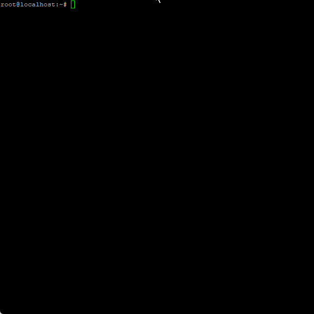

# Linux Server Utility Scripts
**This is still a W.I.P !**

## Scripts

### Swapfile Setup
Allows you to easily setup a swapfile on your system by just giving it a path and a human-readable size.

All the size conversions and checks for available space are done automatically.

GIF Preview&nbsp;&nbsp;<i>(Click to open)</i>

</details

**See:** [swapfile-util.sh](swapfile-util.sh)

## Licenses
This project is licensed under the [CC0 1.0 Universal (CC0 1.0) (Public Domain)](LICENSE-CC0) license.
